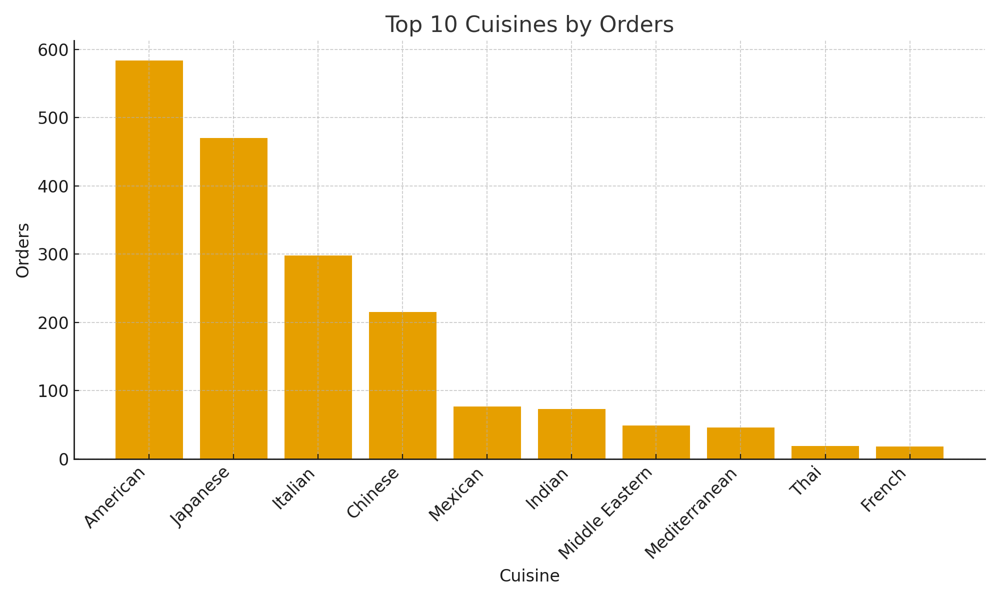
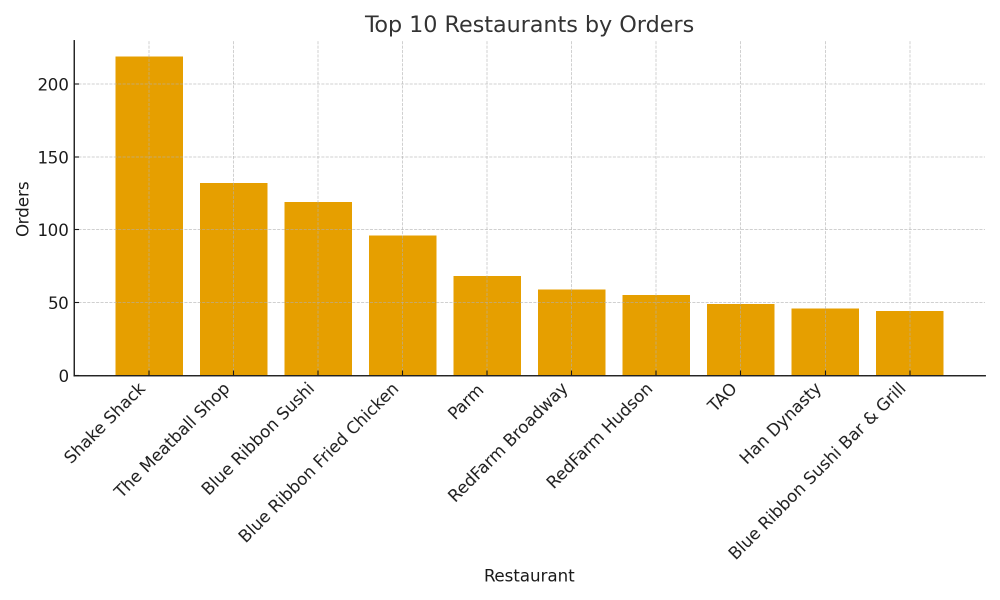
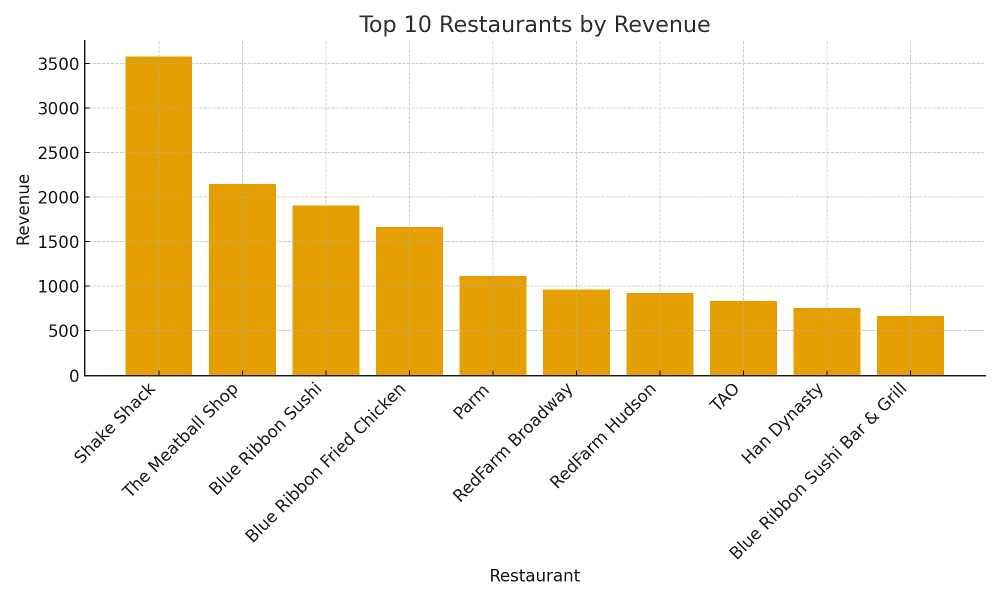
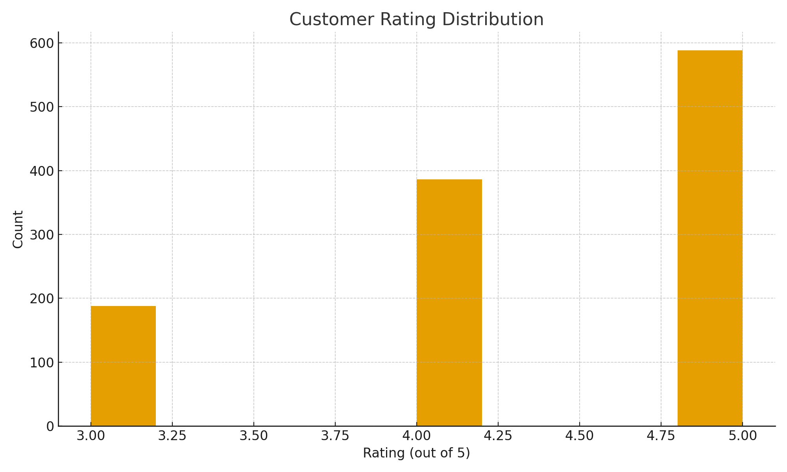
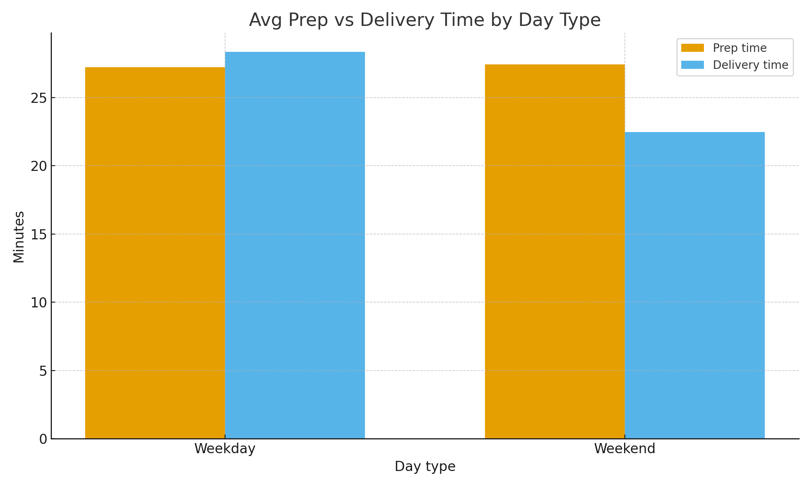

# FoodHub – Online Food Orders (NYC) 📦🍔

**Objective.** Analyze FoodHub order data to understand demand patterns by restaurant and cuisine, and to identify factors impacting customer ratings and delivery speed.

## 📊 Dataset
Columns:
- `order_id`, `customer_id`, `restaurant_name`, `cuisine_type`
- `cost_of_the_order` (USD), `day_of_the_week` (Weekday/Weekend)
- `rating` (out of 5)
- `food_preparation_time` (min), `delivery_time` (min)

Quick stats:

- **Orders:** 1,898
- **Unique customers:** 1200
- **Restaurants:** 178
- **Cuisines:** 14

**Missing values**
|                       |   missing |
|:----------------------|----------:|
| order_id              |         0 |
| customer_id           |         0 |
| restaurant_name       |         0 |
| cuisine_type          |         0 |
| cost_of_the_order     |         0 |
| day_of_the_week       |         0 |
| rating                |         0 |
| food_preparation_time |         0 |
| delivery_time         |         0 |

## 🔎 Key Questions
1. Which **cuisines** and **restaurants** drive the most orders and revenue?
2. How do **prep** and **delivery times** differ between **weekday vs weekend**?
3. What patterns exist in **customer ratings**? Any link to cost/speed?

## ✅ Headline Findings
- Top cuisine by orders: **American** (584 orders).
- Most-demanded restaurant: **Shake Shack** (219 orders).
- Highest revenue restaurant: **Shake Shack** ($3,579.53).
- Average rating: **4.34/5**.
- Avg prep time: **27.4 min**, Avg delivery time: **24.2 min**.
- Correlations (Pearson):
- Rating vs **cost_of_the_order**: 0.03
- Rating vs **food_preparation_time**: -0.01
- Rating vs **delivery_time**: -0.01

## 📈 Visuals

## 🧠 Methods
- Data cleaning & EDA in Python (Pandas, NumPy)
- Aggregations for demand and revenue
- Distribution and group-wise comparisons
- Simple correlations with ratings
